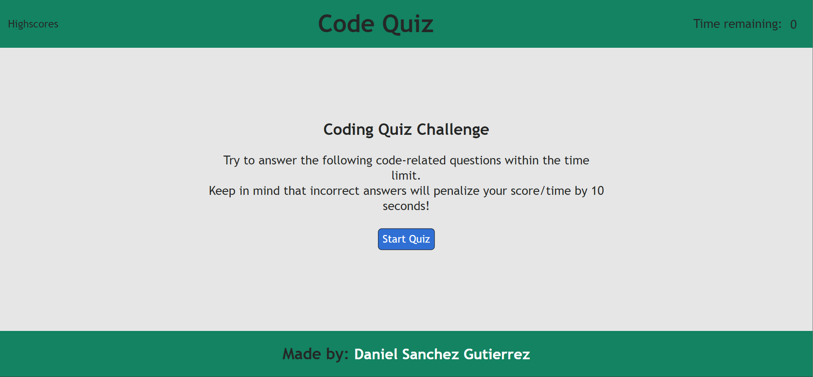
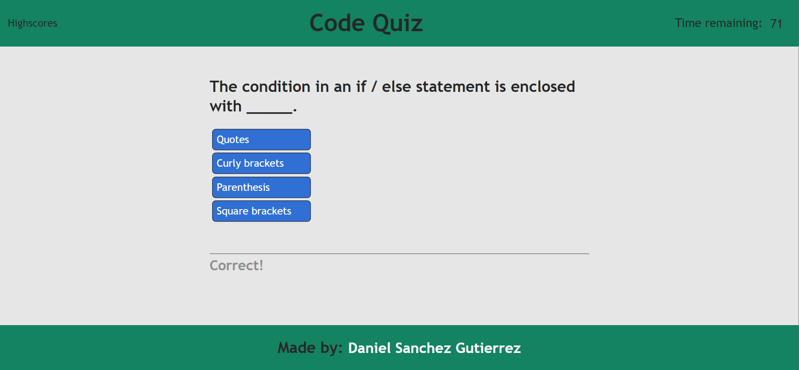
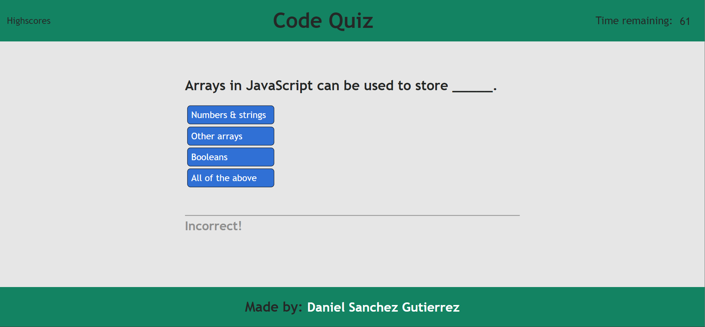
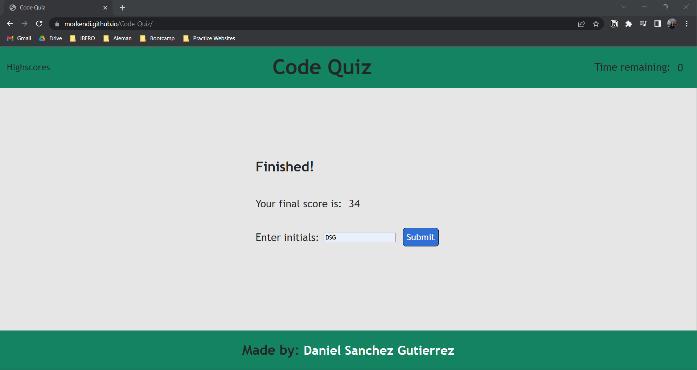

# Code Quiz

## Description
Quizzes are a way for people to practice and test their knowledge regarding a certain topic. In this app, you will be able to test your knowledge of basic Javascript concepts, including a timer and a section where you can store your high scores and keep track of your scores!

## Usage

## Landing page

The landing page consists of 3 main sections:
- ### **Header**: The header section contains 3 elements
  - Highscores: Navigation link to highscores tab
  - Title: Dispays the title of the app
  - Timer: Displays remaining time when the quiz starts
- ### **Main Element**
    - Introduction: Shows an introductory message, along with instructions for the quiz and a button to start the quiz
    - Questionnaire: Once the user starts the quiz, each question (and the answer options) will show, as well as a message stating whether the chosen answer was 
    - Final Score and Submit: After answering all questions, the user will see their final score and an input box to write their initials and submit their score. After clicking on the "submit" button, the user will be redirected to the high scores page.
- ### **Footer**
  - Credits: Inside the footer, the user will credits to the author of the webpage, as well as a link to said author's github profile.

## Highscores page
Inside this page, the user can see the highscore the have submitted, alongside two buttons: one to erase their stored highscores and another to return to the landing page.

## Mock-Up
### Landing page

### Correct Answer

### Wrong answer

### Submit high score

### High score page

--- 

## Credits
- Code by: Daniel Sanchez (https://github.com/Morkendi)
- Video (Used as reference to build certain elements): https://www.youtube.com/watch?v=PBcqGxrr9g8

## Links
- Link to GitHub Pages: https://morkendi.github.io/Code-Quiz/
